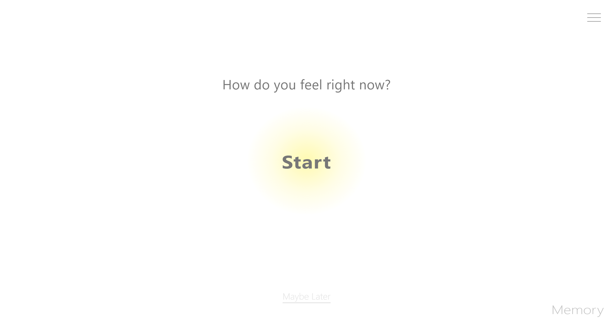
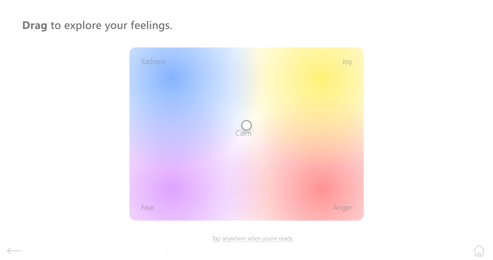

# Emotion Check-in

A web-based emotional reflection tool developed as an individual project for DECO1400 at The University of Queensland.

## Overview

Emotion Check-in is an interactive web application designed to help users identify, reflect on, and better understand their emotions.

The application combines visual interaction, guided reflection, and previous check-in records to make emotional self-reflection more structured and accessible.

## Features

- **Emotion Palette**  
  Select emotions through an interactive visual palette.

- **Body Mapping**  
  Reflect on where emotions are physically experienced in the body.

- **Guided Reflection**  
  Follow prompts that help users think more deeply about their emotional state.

- **Memory (Previous Check-ins)**  
  Review previous emotional check-ins and reflections.

- **FAQ / Information / About**  
  Access supporting information about how to use the application.

## Technologies

- HTML
- CSS
- JavaScript

## How to Run

1. Clone the repository:

   ```bash
   git clone https://github.com/feiyang-tang13/DECO1400.git
2. Open the project folder.
3. Open index.html in a web browser.

No additional installation or dependencies are required.

## Preview

The homepage introduces the experience, while the emotion palette allows users to explore and position their current feelings through an interactive visual interface.

### Homepage


### Emotion Palette


## My Contributions

This was an individual project. I was responsible for:

- interface and interaction design
- front-end implementation
- JavaScript-based interactions
- development of the emotion palette and body mapping features
- guided reflection and memory functionality
- usability-focused iteration and refinement

## Project Context

This project was created for DECO1400 at The University of Queensland.

The project focused on designing and developing an interactive web experience with an emphasis on usability, user engagement, and front-end implementation.

## Repository

GitHub: https://github.com/feiyang-tang13/DECO1400
